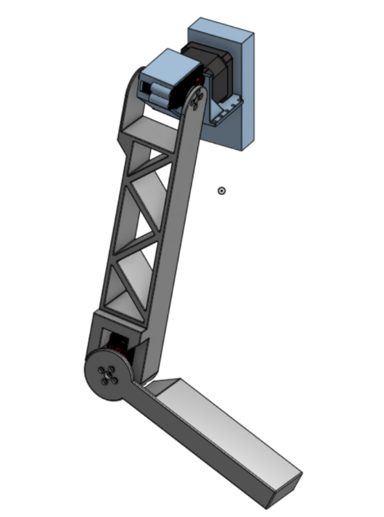

# BMES 2024-2025 Robotic Shoulder Project
This is an image repository for the BMES 24-25 EOH Robotic Shoulder Project (Created by Chris Xu)

__Group Members:__
```
Drew Gura: PM
Victoria "Tori" Gatto : Circuitry
MaryClare Koch : CAD + Poster
Rrebecca Law : Arduino + Poster
Chris Xu : CAD
Kalyn Zhang : Arduino
```
## My Role
My main role on this project was to be the main CAD designer for the shoulder. I used Onshape for the relatively superior cloud work as well as easier online collaboration. The link can be found [here](https://cad.onshape.com/documents/1313e74341f90e3cec24fb78/w/3cf14883398f6c864a7832f6/e/0f94ea15ef14497e90ea7c96?renderMode=0&uiState=680035d90f50eb5e08ef6c45)

## Images
Inital Drawings:



Final Result:


Poster and Skeleton:


